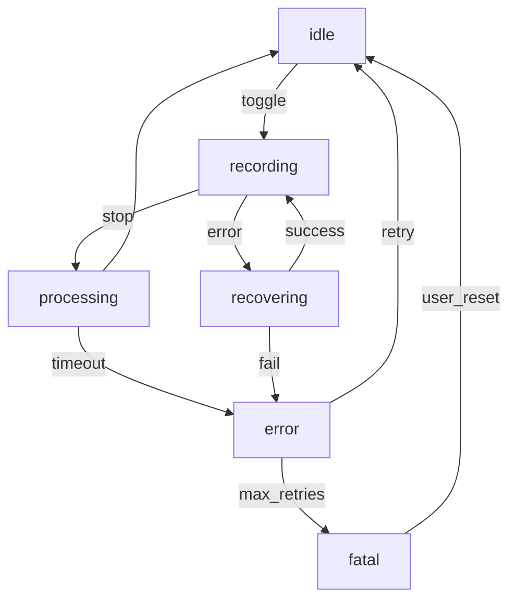

# Implementation Plan – Electron Voice Transcriber (v0.1)

### Overview

We will implement the app in **four incremental sprints (one week each)**.  Core objective is to achieve a functional, low‑latency push‑to‑talk transcription pipeline with robust testing and packaging.  All work will live in a single monorepo managed by **pnpm** and **TurboRepo** for task caching.

```
repo/
├─ apps/
│  └─ desktop/                    # Electron application
│     ├─ src/
│     │  ├─ main/                 # Main‑process TypeScript
│     │  ├─ renderer/             # React renderers (Overlay, Settings)
│     │  ├─ worker/               # Node workers (STTSession)
│     │  └─ preload/              # Context‑bridge preload scripts
│     ├─ assets/
│     └─ package.json
├─ packages/
│  ├─ common/                     # Shared utils (logger, config schema)
│  └─ typings/                    # Global TS types
└─ tools/
   └─ mock‑ws/                    # Mock WebSocket server for tests
```

### Story‑point Legend

* **1 pt:** trivial / glue code (<½ day)
* **2 pt:** normal feature (½–1 day)
* **3 pt:** complex feature (>1 day, <2 days)

---

## Atomic Task Backlog

> **Dependencies:** A → task must be done before B can start.

| #       | Pts | Title & Context                                                                              | Key Files / Functions                                             | Depends On       |
| ------- | --- | -------------------------------------------------------------------------------------------- | ----------------------------------------------------------------- | ---------------- |
| **T1**  | 1   | *Repo bootstrap* – Create monorepo, ESLint, Prettier, TS config                              | `package.json`, `tsconfig.base.json`                              | –                |
| **T2**  | 1   | *Electron boilerplate* – Minimal window + IPC scaffolding                                    | `apps/desktop/src/main/main.ts`, `vite.config.ts`                 | T1               |
| **T3**  | 1   | *Add electron‑builder & NSIS config*                                                         | `electron-builder.json`                                           | T2               |
| **T4**  | 2   | *ShortcutManager (native)* – Integrate **iohook** & debounce                                 | `main/shortcutManager.ts` → `initShortcut()`, `toggleRecording()` | T2               |
| **T5**  | 2   | *RecorderWindow skeleton* – Hidden `BrowserWindow` + `getUserMedia`                          | `main/windows.ts`, `renderer/recorder.ts`                         | T2               |
| **T6**  | 2   | *AudioWorklet processor* – Emit 20 ms PCM frames                                             | `renderer/audio/worklet.ts`, `registerWorklet()`                  | T5               |
| **T7**  | 2   | *IPC streaming channel* – Transfer PCM buffers Main⇆Renderer                                 | `preload/recorderBridge.ts`, `main/ipc/audioStream.ts`            | T6               |
| **T8**  | 2   | *STTSession worker scaffold* – Spawn worker thread, connect WS                               | `worker/sttSession.ts` → `start()`, `appendAudio()`, `end()`      | T7               |
| **T9**  | 3   | *Realtime WS protocol* – Implement OpenAI framing & heartbeat with industry-standard practices | `worker/sttProtocol.ts`                                           | T8               |
| **T10** | 1   | *OverlayWindow skeleton* – Frameless always‑on‑top window                                    | `renderer/overlay/index.tsx`, `tailwind.config.js`                | T2               |
| **T11** | 2   | *Mic animation & level meter* – Use RMS of recent PCM                                        | `renderer/overlay/Meter.tsx`                                      | T10, T7          |
| **T12** | 1   | *ClipboardService* – Write & verify copy                                                     | `main/clipboard.ts` → `copyAndVerify(text)`                       | T2               |
| **T13** | 1   | *SystemTray initial* – Idle icon + Quit                                                      | `main/tray.ts`                                                    | T2               |
| **T14** | 2   | *Settings store (electron‑store)* – Hotkey, API key, overlay pref                            | `common/settings.ts`                                              | T1               |
| **T15** | 2   | *Secure API key storage (DPAPI)*                                                             | `main/crypto.ts`                                                  | T14              |
| **T16** | 1   | *Main state machine* – Orchestrate START/STOP events                                         | `main/state.ts`                                                   | T4, T8, T10, T12 |
| **T17** | 3   | *Latency watchdog* – Measure stop→clipboard, warn if >500 ms                                 | `main/perfMonitor.ts`                                             | T16              |
| **T18** | 2   | *Partial transcript handling (future‑proof)* – Pipe delta events to Overlay (hidden for now) | `worker/sttSession.ts`, `renderer/overlay/Hidden.tsx`             | T9               |
| **T19** | 2   | *Unit tests ShortcutManager & settings*                                                      | `tests/shortcut.spec.ts`                                          | T4, T14          |
| **T20** | 2   | *Mock WS server for integration tests*                                                       | `tools/mock-ws/index.ts`                                          | T9               |
| **T21** | 3   | *Integration test: audio → final transcript*                                                 | `tests/integration/fullFlow.spec.ts`                              | T20, T16         |
| **T22** | 2   | *E2E Playwright: end‑to‑clipboard latency <500 ms*                                           | `tests/e2e/latency.spec.ts`                                       | T21              |
| **T23** | 1   | *Build pipeline (CI)* – GitHub Actions lint + test + build                                   | `.github/workflows/ci.yml`                                        | T3, T19          |
| **T24** | 1   | *Auto‑update feed script*                                                                    | `scripts/publish.mjs`                                             | T3               |
| **T25** | 2   | *Tray settings dialog (renderer)*                                                            | `renderer/settings/index.tsx`                                     | T13, T14         |
| **T26** | 1   | *Installer code‑sign stub*                                                                   | `certs/README.md`                                                 | T3               |
| **T27** | 1   | *Telemetry toggle* – Wrap Sentry init behind config                                          | `main/telemetry.ts`                                               | T14              |
| **T28** | 1   | *Release notes template*                                                                     | `docs/release-notes.md`                                           | –                |
| **T29** | 2   | *First public alpha build*                                                                   | tag + publish to GitHub Releases                                  | T24, T16, T22    |
| **T30** | 2   | *Advanced transcript optimization* – Implement prompt engineering, context preservation, and confidence scoring | `worker/transcriptOptimizer.ts`                                   | T9, T18          |

---

### Sprint Allocation (indicative)

| Sprint | Target Tasks |
| ------ | ------------ |
| **S1** | T1‑T7        |
| **S2** | T8‑T13       |
| **S3** | T14‑T21      |
| **S4** | T22‑T30      |

---

**Notes**

* All renderer code uses **React + Tailwind + Vite**.
* Type safety enforced everywhere (`strict` TS, zod schema for IPC).
* OpenAI Realtime API best practices: VAD, noise reduction, prompt engineering.
* Zoom out, refine estimates once unknowns (WS limits, audio privileges) clarified.

---

## Detailed Task Breakdown

> **Convention:** folder paths are relative to `apps/desktop/src/` unless otherwise stated.

### T1 – Repo bootstrap (1 pt)

**Purpose**  Establish a monorepo with unified linting/formatting and strict TypeScript.

*Scaffolding*

```bash
pnpm init -y
pnpm add -w turbo eslint prettier typescript @typescript-eslint/parser @typescript-eslint/eslint-plugin -D
mkdir -p apps/desktop packages/common packages/typings tools/mock-ws
```

Create:

* `package.json` – workspaces, scripts (`dev`, `lint`, `build`).
* `tsconfig.base.json` – `strict`, `moduleResolution: node16`.
* `.eslintrc.cjs`, `.prettierrc`.

*No pseudocode—pure config.*

---

### T2 – Electron boilerplate (1 pt)

**Purpose**  Get a single `BrowserWindow` on screen and wire IPC foundation.

*Key Files*

* `main/main.ts` – create window, register `ipcMain.handle('ping', …)`.
* `renderer/index.html` – hello splash.
* `vite.config.ts` – two entrypoints (main/renderer).

*Pseudocode*

```ts
// main/main.ts
app.whenReady().then(createMainWindow)
function createMainWindow() {
  const win = new BrowserWindow({
    width: 800, height: 600,
    webPreferences: { preload: join(__dirname,'../preload/index.js') }
  })
  win.loadURL(VITE_DEV_SERVER_URL || 'index.html')
}
```

Fits as the central Electron entry; later windows will reuse helper `createWindow(opts)` util.

---

### T3 – electron‑builder & NSIS config (1 pt)

Ensure packaged app and extra resources are copied; configure update channel.

*Additions*

* **Publish block** for GitHub releases.
* **ExtraResources** to ship `worklet.js` into app root.

```json
{
  "appId": "ai.quicktranscriber.desktop",
  "productName": "QuickTranscriber",
  "files": ["dist/**"],
  "extraResources": [
    {"from": "apps/desktop/src/renderer/audio/worklet.js", "to": "worklet.js"}
  ],
  "publish": [{"provider": "github", "owner": "your‑org", "repo": "quicktranscriber"}],
  "nsis": {"oneClick": true, "perMachine": true}
}
```

Script `"build": "electron-builder --publish never"` remains.

---

### T4 – ShortcutManager (2 pt)

Detect the global hotkey, emit events, and allow **live re‑bind** with graceful fallbacks.

*Files*

```
main/shortcutManager.ts
```

*Industry Best Practices Implementation*

```ts
import { globalShortcut } from 'electron'
import { EventEmitter } from 'node:events'

export const shortcuts = new EventEmitter()

class ShortcutManager {
  private activeKey: string
  private debounceTimer: NodeJS.Timeout | null = null
  private lastTrigger = 0
  private readonly DEBOUNCE_MS = 250

  constructor() {
    this.activeKey = settings.get('hotkey', 'Ctrl+Shift+Space')
  }

  async initShortcut() {
    try {
      // Primary: Electron's built-in globalShortcut (more reliable)
      await this.registerElectronShortcut(this.activeKey)
    } catch (err) {
      console.warn('Electron globalShortcut failed, falling back to uiohook-napi')
      // Fallback: uiohook-napi (better than iohook for newer Electron)
      await this.registerUiohookShortcut(this.activeKey)
    }
  }

  private async registerElectronShortcut(key: string) {
    globalShortcut.unregisterAll()
    
    const success = globalShortcut.register(key, () => {
      this.handleKeyPress()
    })
    
    if (!success) {
      throw new Error(`Failed to register shortcut: ${key}`)
    }
  }

  private async registerUiohookShortcut(key: string) {
    // Dynamic import for optional dependency
    const { uIOhook, UiohookKey } = await import('uiohook-napi')
    
    uIOhook.on('keydown', (e) => {
      if (this.matchesShortcut(e, key)) {
        this.handleKeyPress()
      }
    })
    
    uIOhook.start()
  }

  private handleKeyPress() {
    const now = Date.now()
    
    // Debounce protection
    if (now - this.lastTrigger < this.DEBOUNCE_MS) {
      return
    }
    
    this.lastTrigger = now
    shortcuts.emit('toggle')
  }

  async updateHotkey(newKey: string) {
    this.activeKey = newKey
    await this.initShortcut() // Re-register with new key
    settings.set('hotkey', newKey)
  }

  cleanup() {
    globalShortcut.unregisterAll()
    // uIOhook cleanup if needed
  }
}

export const shortcutManager = new ShortcutManager()
```

**Dependencies**: Add to package.json:
```json
{
  "dependencies": {
    "uiohook-napi": "^1.5.2"
  },
  "optionalDependencies": {
    "uiohook-napi": "^1.5.2"
  }
}
```

`updateHotkey` is invoked by Settings dialog (T25) with auto-retry on registration failure.

---

### T5 – RecorderWindow skeleton (2 pt)

Hidden window capturing mic with error handling & sample‑rate coercion.

*Files*

```
main/windows.ts          # createRecorderWindow()
renderer/recorder/index.ts
```

*Pseudocode (renderer)*

```ts
export async function startCapture(cb:(buf:ArrayBuffer)=>void){
  try{
    const stream = await navigator.mediaDevices.getUserMedia({audio:true})
    const ctx = new AudioContext({sampleRate:16000})
    if(ctx.sampleRate!==16000) throw new Error('Device SR '+ctx.sampleRate)
    await ctx.audioWorklet.addModule('worklet.js')
    const src = ctx.createMediaStreamSource(stream)
    const node = new AudioWorkletNode(ctx,'pcm16',{outputChannelCount:[1]})
    src.connect(node); node.port.onmessage=e=>cb(e.data)
  }catch(err){
    window.electron.invoke('recorder-error', err.message) // Overlay shows toast
  }
}
```

Handles `NotAllowedError` (mic denied) and bad sample‑rate.

---

### T6 – AudioWorklet processor (2 pt)

Enhanced audio processing with level detection and quality optimization.

`renderer/audio/worklet.ts`

```ts
class PCMWorklet extends AudioWorkletProcessor {
  private chunkSize = 640 // 20ms at 16kHz (16000 * 0.02 * 2 bytes)
  private buffer = new Float32Array(this.chunkSize / 2)
  private bufferIndex = 0
  private levelHistory: number[] = []

  process(inputs) {
    const input = inputs[0]
    const channel = input[0]
    
    if (!channel) return true

    for (let i = 0; i < channel.length; i++) {
      // Accumulate samples until we have a full 20ms chunk
      this.buffer[this.bufferIndex] = channel[i]
      this.bufferIndex++

      if (this.bufferIndex >= this.buffer.length) {
        this.processChunk()
        this.bufferIndex = 0
      }
    }

    return true
  }

  private processChunk() {
    // Calculate RMS level for UI feedback
    const rms = this.calculateRMS(this.buffer)
    this.levelHistory.push(rms)
    if (this.levelHistory.length > 10) this.levelHistory.shift()

    // Convert to 16-bit PCM with proper quantization
    const pcm16 = new Int16Array(this.buffer.length)
    for (let i = 0; i < this.buffer.length; i++) {
      // Apply soft clipping to prevent distortion
      const clamped = Math.max(-1, Math.min(1, this.buffer[i]))
      pcm16[i] = Math.round(clamped * 0x7FFF)
    }

    // Send audio data and level info
    this.port.postMessage({
      type: 'audio-chunk',
      data: pcm16.buffer,
      level: rms,
      avgLevel: this.levelHistory.reduce((a, b) => a + b) / this.levelHistory.length
    }, [pcm16.buffer])
  }

  private calculateRMS(samples: Float32Array): number {
    let sum = 0
    for (let i = 0; i < samples.length; i++) {
      sum += samples[i] * samples[i]
    }
    return Math.sqrt(sum / samples.length)
  }
}

registerProcessor('pcm16', PCMWorklet)
```

Feeds 20 ms chunks to IPC (T7) with audio level data for overlay animations.

---

### T7 – IPC streaming channel (2 pt)

Efficient transfer of binary buffers.

*Files*

* `preload/recorderBridge.ts`
* `main/ipc/audioStream.ts`

*Pseudocode*

```ts
// preload
contextBridge.exposeInMainWorld('audio',{
  send:(buf:ArrayBuffer)=> ipcRenderer.send('audio-chunk',buf)
})
// main
ipcMain.on('audio-chunk',(e,buf)=> sttWorker.postMessage(buf,[buf]))
```

Uses transferable objects to avoid copy cost.

---

### T8 – STTSession worker scaffold (2 pt)

Spawn Node Worker thread.

*Files*

```
worker/sttSession.ts
```

*Pseudocode*

```ts
parentPort.on('message', msg => {
  if (msg.type==='start') openWs()
  else if (msg.type==='audio') ws.send(buildAppend(msg.buf))
  else if (msg.type==='end') ws.send(buildEnd())
})
```

Relies on protocol builder (T9).

---

### T9 – Realtime WS protocol (3 pt)

Maintain authenticated WebSocket session with OpenAI; heartbeat & reconnect with industry-standard practices.

*Key components*

* **Authentication**: include `Authorization: Bearer <apiKey>` header OR ephemeral token from `/v1/realtime/transcription_sessions`.
* **Exponential back-off** reconnect (100ms → 1.6s → 25.6s max) on network failure.
* **Heartbeat**: WebSocket native ping/pong every 30s; if no response in 10s, reconnect.
* **VAD Integration**: Use server-side Voice Activity Detection for better turn management.
* **Noise Reduction**: Enable `near_field` noise reduction for desktop mic scenarios.
* **Framing helpers**: `sessionUpdate()`, `append(buf)`, `end()`, `commit()`.

*Enhanced Session Configuration*

```ts
const sessionConfig = {
  type: "transcription_session.update",
  input_audio_format: "pcm16",
  input_audio_transcription: {
    model: "gpt-4o-transcribe",
    prompt: "", // For context/terminology hints
    language: "en"
  },
  turn_detection: {
    type: "server_vad",
    threshold: 0.5,
    prefix_padding_ms: 300,
    silence_duration_ms: 500
  },
  input_audio_noise_reduction: {
    type: "near_field"  // Desktop microphone scenario
  },
  include: [
    "item.input_audio_transcription.logprobs"  // For confidence scoring
  ]
}
```

*Robust Connection Management*

```ts
class STTProtocol {
  private reconnectAttempts = 0
  private maxReconnectAttempts = 5
  private heartbeatInterval: NodeJS.Timeout
  private lastPongReceived = Date.now()

  async connect() {
    try {
      this.ws = new WebSocket('wss://api.openai.com/v1/realtime?intent=transcription', {
        headers: { Authorization: `Bearer ${await this.getApiKey()}` }
      })
      
      this.ws.on('open', () => this.onConnected())
      this.ws.on('message', (data) => this.handleMessage(JSON.parse(data.toString())))
      this.ws.on('close', (code) => this.handleDisconnection(code))
      this.ws.on('error', (err) => this.handleError(err))
      this.ws.on('pong', () => this.lastPongReceived = Date.now())
      
    } catch (err) {
      this.scheduleReconnect()
    }
  }

  private onConnected() {
    this.reconnectAttempts = 0
    this.ws.send(JSON.stringify(sessionConfig))
    this.startHeartbeat()
  }

  private startHeartbeat() {
    this.heartbeatInterval = setInterval(() => {
      if (Date.now() - this.lastPongReceived > 10000) {
        this.ws.close(1006, 'Heartbeat timeout')
        return
      }
      this.ws.ping()
    }, 30000)
  }

  private scheduleReconnect() {
    if (this.reconnectAttempts >= this.maxReconnectAttempts) {
      parentPort.postMessage({ type: 'fatal-error', error: 'Max reconnection attempts exceeded' })
      return
    }
    
    const delay = Math.min(100 * Math.pow(1.6, this.reconnectAttempts), 25600)
    setTimeout(() => this.connect(), delay)
    this.reconnectAttempts++
  }

  private handleMessage(msg: any) {
    switch (msg.type) {
      case 'transcript.text.delta':
        parentPort.postMessage({ type: 'transcript-partial', text: msg.delta })
        break
      case 'transcript.text.done':
        parentPort.postMessage({ 
          type: 'transcript-final', 
          text: msg.transcript,
          confidence: msg.logprobs ? this.calculateConfidence(msg.logprobs) : null
        })
        break
      case 'input_audio_buffer.committed':
        // Audio chunk successfully processed
        break
      case 'error':
        this.handleApiError(msg)
        break
    }
  }

  appendAudio(buffer: ArrayBuffer) {
    if (this.ws?.readyState === WebSocket.OPEN) {
      this.ws.send(JSON.stringify({
        type: 'input_audio_buffer.append',
        audio: Buffer.from(buffer).toString('base64')
      }))
    } else {
      // Queue audio or trigger reconnection
      this.queueAudio(buffer)
    }
  }
}
```

On `transcript.text.done`, post to parentPort with confidence scoring.

---

### T10 – OverlayWindow skeleton (1 pt)

Frameless, always‑on‑top overlay positioned bottom‑right with error flash capability.

*Window creation*

```ts
// main/windows.ts
function createOverlay(){
  const wa = screen.getPrimaryDisplay().workArea
  return new BrowserWindow({
    width:350,height:120,
    x:wa.x+wa.width-350,
    y:wa.y+wa.height-160,
    frame:false,transparent:true,alwaysOnTop:true,resizable:false,
    webPreferences:{preload:join(__dirname,'../preload/overlayBridge.js')}
  })
}
```

*React component*

```tsx
export default function Overlay({status,text}:{status:'recording'|'error'|'idle',text?:string}){
  if(status==='idle') return null
  return <div className={`rounded-3xl backdrop-blur p-4 ${status==='error'? 'bg-red-500/70':'bg-white/10'}`}>
    {status==='recording' ? <MicIcon className="animate-pulse"/> : '⚠️'} {text||'Recording…'}
  </div>
}
```

Expose `window.overlay.flash(msg)` via preload that sets `status:'error'` for 1 s.

---

### T11 – Mic animation & level meter (2 pt)

Compute RMS from latest PCM samples (shared via IPC broadcast) and animate SVG bars.

```tsx
const [level,setLevel]=useState(0)
useEffect(()=> window.electron.onLevel((v)=>setLevel(v)),[])
return <Equalizer level={level}/>
```

*Algorithm*

```
level = sqrt(sum(samples²)/N) / 32768
```

---

### T12 – ClipboardService (1 pt)

`main/clipboard.ts`

```ts
export async function copyAndVerify(text:string){
  clipboard.writeText(text)
  return clipboard.readText()===text
}
```

Returns boolean to state machine.

---

### T13 – SystemTray initial (1 pt)

Create Tray icon with Idle + Quit.

*Files*

* `main/tray.ts`

```ts
const tray = new Tray(nativeImage.createFromPath('idle.png'))
tray.setContextMenu(Menu.buildFromTemplate([{label:'Quit', click:()=>app.quit()}]))
```

---

### T14 – Settings store (2 pt)

Central config using `electron-store`.

```ts
import Store from 'electron-store'
export const settings = new Store<{
  hotkey:string; openaiKey:string; showOverlay:boolean; model:string
}>({defaults:{hotkey:'Ctrl+Shift+Space',showOverlay:true,model:'gpt-4o-transcribe'}})
```

Json schema ensures type‑safe reads.

---

### T15 – Secure API key storage (2 pt)

Encrypt/decrypt via Windows DPAPI.

```ts
export function saveKey(k:string){ settings.set('openaiKey', dpapi.encrypt(k)) }
export function loadKey(){ return dpapi.decrypt(settings.get('openaiKey')) }
```

Integrates in STTSession for `Authorization` header.

---

### T16 – Main state machine with robust error recovery (2 pt)

Finite‑state machine with graceful fallbacks and auto-recovery.



*Enhanced State Manager*

```ts
// main/stateManager.ts
enum AppState {
  IDLE = 'idle',
  RECORDING = 'recording', 
  PROCESSING = 'processing',
  ERROR = 'error',
  RECOVERING = 'recovering',
  FATAL = 'fatal'
}

class StateManager extends EventEmitter {
  private currentState = AppState.IDLE
  private retryCount = 0
  private readonly MAX_RETRIES = 3
  private errorRecoveryTimer?: NodeJS.Timeout

  async transition(targetState: AppState, data?: any) {
    const allowed = this.isTransitionAllowed(this.currentState, targetState)
    if (!allowed) {
      console.warn(`Invalid transition: ${this.currentState} -> ${targetState}`)
      return false
    }

    const prevState = this.currentState
    this.currentState = targetState
    
    await this.onStateEnter(targetState, data)
    this.emit('state-changed', { from: prevState, to: targetState, data })
    
    return true
  }

  private async onStateEnter(state: AppState, data?: any) {
    switch (state) {
      case AppState.RECORDING:
        await this.startRecording()
        break
      case AppState.PROCESSING:
        await this.processTranscript(data.transcript)
        break
      case AppState.ERROR:
        await this.handleError(data.error)
        break
      case AppState.RECOVERING:
        await this.attemptRecovery()
        break
      case AppState.FATAL:
        await this.handleFatalError(data.error)
        break
    }
  }

  private async handleError(error: Error) {
    this.retryCount++
    
    // Show error in overlay
    overlayWindow.show('error', `Error: ${error.message}`)
    
    if (this.retryCount < this.MAX_RETRIES) {
      // Auto-retry after delay
      this.errorRecoveryTimer = setTimeout(() => {
        this.transition(AppState.RECOVERING)
      }, 2000 * this.retryCount) // Exponential backoff
    } else {
      this.transition(AppState.FATAL, { error })
    }
  }

  private async attemptRecovery() {
    try {
      // Test WebSocket connection
      await sttSession.testConnection()
      
      // Test audio capture
      await recorderWindow.testAudioCapture()
      
      // Recovery successful
      this.retryCount = 0
      await this.transition(AppState.IDLE)
      overlayWindow.hide()
      
    } catch (error) {
      await this.transition(AppState.ERROR, { error })
    }
  }

  private async handleFatalError(error: Error) {
    // Show persistent error notification
    systemTray.showError('Recording system failed. Click to restart.')
    
    // Log for diagnostics
    console.error('Fatal error:', error)
    logger.error('Fatal state reached', { error: error.message, stack: error.stack })
    
    // Wait for user intervention
    systemTray.on('click', () => {
      this.retryCount = 0
      this.transition(AppState.IDLE)
    })
  }
}
```

---

### T17 – Latency watchdog (3 pt)

Measure stop→clipboard latency and trigger overlay flash on breach.

```ts
import { flash } from '../windows/overlayBridge'
const start = performance.now()
copyAndVerify(text).then(ok=>{
  const delta = performance.now()-start
  if(!ok || delta>500) flash(`Slow (${Math.round(delta)} ms) or copy failed`)
})
```

Also logs to `electron-log` with level `warn`.

---

### T18 – Partial transcript handling (2 pt)

Optional future UI; currently keep events but suppress display.

Add `onDelta` handler in `STTSession` → forward to renderer via IPC; Overlay keeps hidden div.

---

### T19 – Unit tests ShortcutManager & settings (2 pt)

Comprehensive unit testing with **vitest** and **@vitest/ui**.

*Test Files Structure*

```
tests/
├─ unit/
│  ├─ shortcutManager.spec.ts
│  ├─ settings.spec.ts
│  ├─ clipboardService.spec.ts
│  └─ stateManager.spec.ts
├─ integration/
│  ├─ audioCapture.spec.ts
│  └─ fullFlow.spec.ts
└─ e2e/
   └─ latency.spec.ts
```

*Unit Test Examples*

```ts
// tests/unit/shortcutManager.spec.ts
import { vi, describe, it, expect, beforeEach } from 'vitest'
import { shortcutManager } from '../../src/main/shortcutManager'

vi.mock('electron', () => ({
  globalShortcut: {
    register: vi.fn(),
    unregisterAll: vi.fn()
  }
}))

describe('ShortcutManager', () => {
  beforeEach(() => {
    vi.clearAllMocks()
  })

  it('debounces rapid key presses', async () => {
    const mockEmit = vi.fn()
    shortcutManager.shortcuts.emit = mockEmit
    
    // Simulate rapid presses within debounce window
    shortcutManager.handleKeyPress()
    shortcutManager.handleKeyPress()
    
    expect(mockEmit).toHaveBeenCalledTimes(1)
  })

  it('falls back to uiohook when electron shortcut fails', async () => {
    const electronShortcut = vi.mocked(globalShortcut.register)
    electronShortcut.mockReturnValue(false)
    
    await shortcutManager.initShortcut()
    
    expect(electronShortcut).toHaveBeenCalled()
    // Should attempt fallback (mock uiohook import)
  })
})

// tests/unit/audioCapture.spec.ts - Mock audio testing
describe('AudioCapture', () => {
  it('handles microphone permission denied', async () => {
    const mockGetUserMedia = vi.fn().mockRejectedValue(
      new Error('Permission denied')
    )
    Object.defineProperty(navigator, 'mediaDevices', {
      value: { getUserMedia: mockGetUserMedia }
    })
    
    const result = await startCapture()
    expect(result.error).toContain('Permission denied')
  })
})
```

---

### T20 – Mock WS server for comprehensive testing (2 pt)

Advanced WebSocket server with realistic OpenAI API simulation and audio fixture generation.

*Files*

```
tools/mock-ws/
├─ server.ts          # Main WebSocket server
├─ fixtures.ts        # Audio data generation
└─ responses.ts       # OpenAI response templates
```

*Enhanced Features*

```ts
// tools/mock-ws/server.ts
export class MockSTTServer {
  private server: WebSocketServer
  private clients = new Set<WebSocket>()
  
  constructor(port = 19000) {
    this.server = new WebSocketServer({ port })
    this.server.on('connection', this.handleConnection.bind(this))
  }

  private handleConnection(ws: WebSocket) {
    this.clients.add(ws)
    
    ws.on('message', (data) => {
      const msg = JSON.parse(data.toString())
      
      switch (msg.type) {
        case 'transcription_session.update':
          this.sendSessionConfirmation(ws)
          break
        case 'input_audio_buffer.append':
          this.handleAudioChunk(ws, msg)
          break
      }
    })
  }

  private handleAudioChunk(ws: WebSocket, msg: any) {
    // Simulate processing delay
    setTimeout(() => {
      // Send partial transcript
      ws.send(JSON.stringify({
        type: 'transcript.text.delta',
        delta: 'hello '
      }))
      
      // Send final transcript after more chunks
      setTimeout(() => {
        ws.send(JSON.stringify({
          type: 'transcript.text.done',
          transcript: 'hello world test transcription',
          logprobs: generateMockLogprobs()
        }))
      }, 100)
    }, 50)
  }
}

// tools/mock-ws/fixtures.ts
export class AudioFixtures {
  static pcmSilence(durationMs: number): Buffer {
    const sampleRate = 16000
    const samples = Math.floor((durationMs / 1000) * sampleRate)
    return Buffer.alloc(samples * 2) // 16-bit = 2 bytes per sample
  }

  static pcmTone(frequency: number, durationMs: number): Buffer {
    const sampleRate = 16000
    const samples = Math.floor((durationMs / 1000) * sampleRate)
    const buffer = Buffer.alloc(samples * 2)
    
    for (let i = 0; i < samples; i++) {
      const sample = Math.sin(2 * Math.PI * frequency * i / sampleRate) * 0x7FFF
      buffer.writeInt16LE(sample, i * 2)
    }
    
    return buffer
  }

  static pcmSpeech(text: string): Buffer {
    // Generate deterministic "speech" patterns based on text
    // Useful for testing specific transcription scenarios
    return this.pcmTone(440 + text.length * 10, text.length * 100)
  }
}
```

---

### T21 – Integration test: audio → final transcript (3 pt)

Full-stack integration testing with realistic audio simulation.

*Enhanced Test Strategy*

```ts
// tests/integration/fullFlow.spec.ts
import { test, expect } from '@playwright/test'
import { MockSTTServer, AudioFixtures } from '../../tools/mock-ws'

test.describe('Full Audio Flow', () => {
  let mockServer: MockSTTServer
  
  test.beforeAll(async () => {
    mockServer = new MockSTTServer(19001)
    await mockServer.start()
  })

  test('complete recording cycle', async ({ page }) => {
    // Launch app with mock endpoint
    const electronApp = await electron.launch({
      args: ['.'],
      env: {
        ...process.env,
        OPENAI_WS_URL: 'ws://localhost:19001',
        NODE_ENV: 'test'
      }
    })

    // Simulate hotkey press
    await page.keyboard.press('Control+Shift+Space')
    
    // Verify overlay appears
    await expect(page.locator('[data-testid="recording-overlay"]')).toBeVisible()
    
    // Inject audio fixture via IPC
    await electronApp.evaluate(async ({ clipboard }, testAudio) => {
      const { ipcMain } = require('electron')
      
      // Simulate audio chunks
      const chunks = AudioFixtures.pcmSpeech('test transcription')
      for (let i = 0; i < chunks.length; i += 640) {
        ipcMain.emit('audio-chunk', null, chunks.slice(i, i + 640))
        await new Promise(resolve => setTimeout(resolve, 20))
      }
    })
    
    // Stop recording
    await page.keyboard.press('Control+Shift+Space')
    
    // Verify clipboard contains expected text
    const clipboardContent = await electronApp.evaluate(async ({ clipboard }) => {
      return clipboard.readText()
    })
    
    expect(clipboardContent).toBe('test transcription')
  })
})
```

---

### T22 – E2E Playwright latency & reliability (2 pt)

Real-world performance testing with comprehensive scenarios.

*Multi-Scenario Approach*

```ts
// tests/e2e/performance.spec.ts
test.describe('Performance & Reliability', () => {
  test('end-to-clipboard latency under load', async () => {
    const measurements: number[] = []
    
    for (let i = 0; i < 10; i++) {
      const startTime = performance.now()
      
      // Trigger recording cycle
      await page.keyboard.press('Control+Shift+Space')
      await page.waitForSelector('[data-testid="recording"]')
      
      // Inject standard test audio
      await injectAudioFixture(page, 'standard-phrase')
      
      // Stop recording and measure to clipboard
      await page.keyboard.press('Control+Shift+Space')
      
      await page.waitForFunction(() => {
        return navigator.clipboard.readText().then(text => text !== '')
      })
      
      const endTime = performance.now()
      measurements.push(endTime - startTime)
    }
    
    const avgLatency = measurements.reduce((a, b) => a + b) / measurements.length
    const maxLatency = Math.max(...measurements)
    
    expect(avgLatency).toBeLessThan(400) // Target: 400ms average
    expect(maxLatency).toBeLessThan(500) // Absolute: 500ms max
  })

  test('handles network interruption gracefully', async () => {
    // Start recording
    await page.keyboard.press('Control+Shift+Space')
    
    // Simulate network failure
    await mockServer.simulateNetworkFailure()
    
    // Verify error state shows in overlay
    await expect(page.locator('[data-testid="error-overlay"]')).toBeVisible()
    
    // Restore network
    await mockServer.restoreNetwork()
    
    // Verify recovery
    await expect(page.locator('[data-testid="recording-overlay"]')).toBeVisible()
  })
})

---

### T23 – Build pipeline (CI) (1 pt)

GitHub Actions: matrix (windows‑latest), steps: checkout, pnpm‑install, lint, test, build.

---

### T24 – Auto‑update feed script (1 pt)

`scripts/publish.mjs` uploads artifacts to GitHub Releases and generates `latest.yml`.

---

### T25 – Tray settings dialog (2 pt)

React window with `@/components/ui/card` & `Input` for API key; IPC to save.

---

### T26 – Installer code‑sign stub (1 pt)

Document how to place `cert.pfx` and set `CSC_LINK` env var.

---

### T27 – Telemetry toggle (1 pt)

Wrap `import * as Sentry` in `if(settings.get('telemetry'))`.

---

### T28 – Release notes template (1 pt)

Markdown template with sections *Added*, *Fixed*, *Changed*.

---

### T29 – First public alpha build (2 pt)

Tag `v0.1.0-alpha`, run CI build, upload installer & `latest.yml`.

---

### T30 – Advanced transcript optimization (2 pt)

Implement prompt engineering, context preservation, and confidence scoring based on OpenAI docs.

*Features*

* **Dynamic Prompting**: Context-aware prompts for technical terms, proper nouns, and domain-specific vocabulary.
* **Confidence Scoring**: Use logprobs to determine transcript reliability.
* **Context Preservation**: Maintain conversation context across recording sessions.
* **Post-processing**: Optional GPT-4 correction for improved accuracy.

```ts
// worker/transcriptOptimizer.ts
export class TranscriptOptimizer {
  private contextHistory: string[] = []
  private domainTerms: Set<string> = new Set()
  
  generatePrompt(context?: string): string {
    const basePrompt = "High-quality transcription for desktop voice input."
    
    const domainContext = this.domainTerms.size > 0 
      ? `Technical terms: ${Array.from(this.domainTerms).join(', ')}.`
      : ""
      
    const conversationContext = this.contextHistory.length > 0
      ? `Previous context: ${this.contextHistory.slice(-2).join(' ')}`
      : ""
    
    return [basePrompt, domainContext, conversationContext, context]
      .filter(Boolean)
      .join(' ')
  }

  calculateConfidence(logprobs: any[]): number {
    if (!logprobs?.length) return 0.8 // Default confidence
    
    const avgLogprob = logprobs.reduce((sum, lp) => sum + lp.logprob, 0) / logprobs.length
    // Convert log probability to confidence score (0-1)
    return Math.max(0, Math.min(1, Math.exp(avgLogprob)))
  }

  async optimizeTranscript(text: string, confidence: number): Promise<string> {
    // Store in context history
    this.contextHistory.push(text)
    if (this.contextHistory.length > 5) this.contextHistory.shift()
    
    // Extract potential domain terms for future prompts
    this.extractDomainTerms(text)
    
    // If confidence is low, offer GPT-4 post-processing
    if (confidence < 0.7 && settings.get('enablePostProcessing', false)) {
      return await this.postProcessWithGPT4(text)
    }
    
    return text
  }

  private extractDomainTerms(text: string) {
    // Extract capitalized words, technical terms, etc.
    const terms = text.match(/\b[A-Z][a-zA-Z]{2,}\b/g) || []
    terms.forEach(term => this.domainTerms.add(term))
    
    // Keep domain terms list manageable
    if (this.domainTerms.size > 50) {
      const termsArray = Array.from(this.domainTerms)
      this.domainTerms = new Set(termsArray.slice(-30))
    }
  }

  private async postProcessWithGPT4(text: string): Promise<string> {
    // Implementation for GPT-4 post-processing if needed
    // This would use the standard OpenAI API, not realtime
    return text // Placeholder
  }
}
```

Integrates with T9 (STTSession) to provide context-aware transcription prompts and T18 for confidence-based partial transcript filtering.

---

*End of plan – v0.2  (June 26 2025)*
