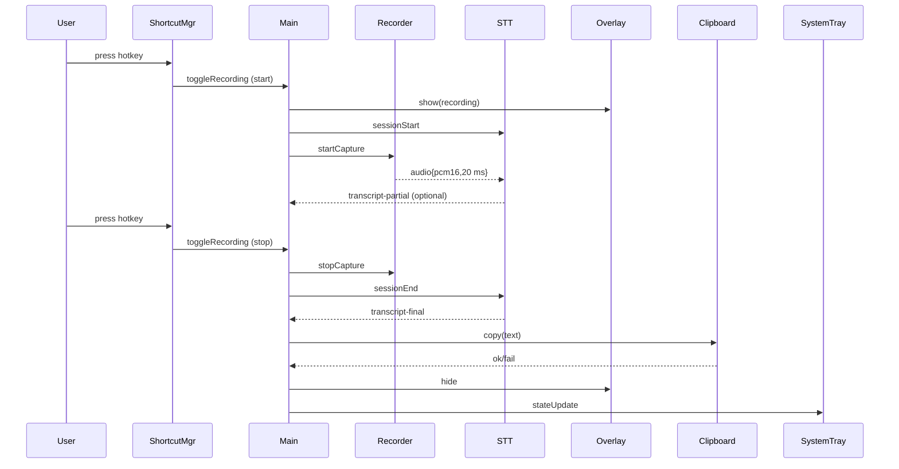

# Electron Voice Transcriber – Technical Specification (v0.4)

## 1 Product Goal

Ultra‑low‑latency push‑to‑talk transcription to clipboard using **OpenAI **\`\`** realtime WebSocket API**. Recording is toggled by `Ctrl + Shift + Space` (press once ▷ start, press again ▷ stop). While active, a bottom‑right overlay shows a mic animation only; it remains hidden when idle. The final transcript is copied to the clipboard in ≤ 500 ms after the user stops recording.

## 2 Target Platform

* Windows 10/11 ×64
* Electron 30 (Chromium 126) + Node 20

## 3 High‑Level Architecture

| Module               | Type                    | Responsibility                                                                                                                                                                 |
| -------------------- | ----------------------- | ------------------------------------------------------------------------------------------------------------------------------------------------------------------------------ |
| **MainProcess**      | Electron Main           | Global state machine, IPC hub, system‑tray UI                                                                                                                                  |
| **ShortcutManager**  | Native (`iohook`)       | Detect `Ctrl + Shift + Space` key‑down; emit `toggleRecording`                                                                                                                 |
| **RecorderWindow**   | Hidden Renderer         | Capture mic via `AudioWorklet`, stream raw PCM16 buffers to STTSession                                                                                                         |
| **STTSession**       | Node Worker (WebSocket) | Maintain realtime transcription session with `wss://api.openai.com/v1/realtime?intent=transcription`, model `gpt‑4o‑transcribe`; send audio buffers, emit partial & final text |
| **OverlayWindow**    | Frameless Renderer      | Mic/level animation during recording                                                                                                                                           |
| **ClipboardService** | Helper                  | Copy final text, verify                                                                                                                                                        |
| **SystemTray**       | Tray                    | Status icon, settings dialog                                                                                                                                                   |

## 4 Event Flow



> **Latency budget:** ≤ 500 ms from `sessionEnd` command to successful clipboard write.

## 5 Detailed Components

### 5.1 ShortcutManager

* `iohook` captures global key‑down.
* Debounce 250 ms.
* Emits `recording-start` when idle, `recording-stop` when active.

### 5.2 RecorderWindow

* Off‑screen `BrowserWindow` (1 × 1, `show:false`).
* `getUserMedia({audio:true})` → `AudioWorklet` outputs 16‑bit little‑endian PCM @ 16 kHz.
* Sends 20 ms (640 bytes) buffers to Main via IPC stream.

### 5.3 STTSession (worker thread)

* Opens authenticated WebSocket: `wss://api.openai.com/v1/realtime?intent=transcription`.
* Initial \`\` payload:

  ```json
  {
    "type": "transcription_session.update",
    "input_audio_format": "pcm16",
    "input_audio_transcription": {
      "model": "gpt-4o-transcribe",
      "language": "en"
    },
    "turn_detection": null
  }
  ```
* For each IPC audio buffer, send `input_audio_buffer.append` with base64 payload.
* On `recording-stop`, send `input_audio_buffer.end` then await:

  * `transcript.text.done` event → final transcript string.
* Emits `transcript-final` to Main.
* Optional: Forward `transcript.text.delta` (partial) if future UX wants live captions.

### 5.4 OverlayWindow

* Position: bottom‑right (`screen.workArea.x + workArea.width − 350`, `workArea.y + workArea.height − 160`).
* Tailwind **glassmorphism** card (opacity 0.9, blur backdrop).
* Displays pulsing mic icon and live level meter (drawn from RMS of last PCM buffer) while recording.

### 5.5 ClipboardService

* `clipboard.writeText(finalText)` then immediate read‑back check.
* On failure, show toast via Overlay in error mode.

### 5.6 SystemTray

* Icon states: ✅ idle │ 🔴 recording │ ⚠️ error.
* Menu items: **API Key**, **Hotkey**, **Launch on Boot**, **Quit**.
* Settings stored in `electron-store` JSON.

## 6 Persistence & Settings

```json
{
  "hotkey": "Ctrl+Shift+Space",
  "openaiKey": "<encrypted DPAPI string>",
  "showOverlay": true,
  "model": "gpt-4o-transcribe"
}
```

## 7 Packaging & Updates

* `electron-builder` NSIS, delta updates via GitHub Releases.
* Auto‑update checks daily at app‑start.

## 8 Logging & Telemetry

* `electron-log` daily‑rotated file.
* Optional Sentry capture; **disabled by default**.

## 9 Security

* API key encrypted with Windows DPAPI.
* TLS 1.2+ WebSocket to `api.openai.com` only.
* Sandboxed renderers; no nodeIntegration in Recorder/Overlay.

## 10 Testing

* **Unit:** Jest (ShortcutManager debouncing, settings).
* **Integration:** Mock WebSocket server streaming transcripts.
* **E2E:** Playwright: simulate audio, measure end‑to‑clipboard latency ≤ 500 ms.

---

*Document owner: You (Product) / Me (Tech). Version 0.4 – June 26 2025.*
